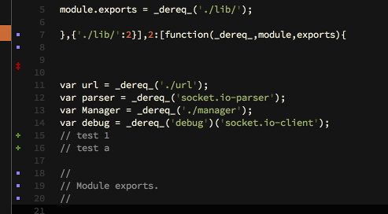

# P4Gutter
----------

Sublime Text 3 plugin to display Perforce diffs in the gutter. See additions, deletions, and modifications.


### Looks like



### Installation
Look for the *P4Gutter* package in Sublime [Package Control](https://sublime.wbond.net/).


### Setup
* You'll need the Perforce command line client ([Perforce Downloads](http://www.perforce.com/downloads/Perforce/Customer)).
* Edit settings from <kbd>Preferences</kbd> > <kbd>Package Settings</kbd> > <kbd>P4Gutter</kbd> > <kbd>Settings</kbd>.
* Optionally, create ```.p4_workspace``` files, containing the name of the workspace, in your workspace root directories.


### Usage
#### Gutter Icons
The gutter is updated on file **open** and **save** events.

#### Additional Commands
<kbd>Annotations</kbd><br>
This opens a new file to display Perforce annotations with change list number and user name prefixed to each line.
Run the ```P4 Annotations``` command from the Sublime command palette;
or you can add a key binding to the ```p4_annotation``` command in your "Key Bindings - User" file, like:

```
    { "keys": ["super+shift+a"], "command": "p4_annotation" }
```


### License
MIT Licensed


### Thanks
Icons from [GitGutter](https://github.com/jisaacks/GitGutter) by [JD Isaacks](https://github.com/jisaacks).
